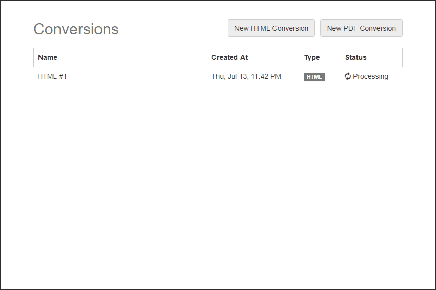

This is a fake in-memory job queue, implemented using Node.js and AngularJS.

<p align="center"></img></p>

### Running It
```
    npm install
    npm start
```

It will create a web server that listens on port 3000. You can access it on:
```
http://localhost:3000
```

The server watches for file changes and use gulp to build the client assets.
